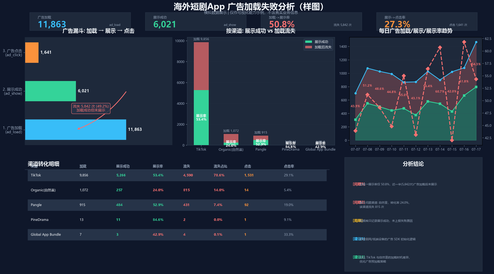
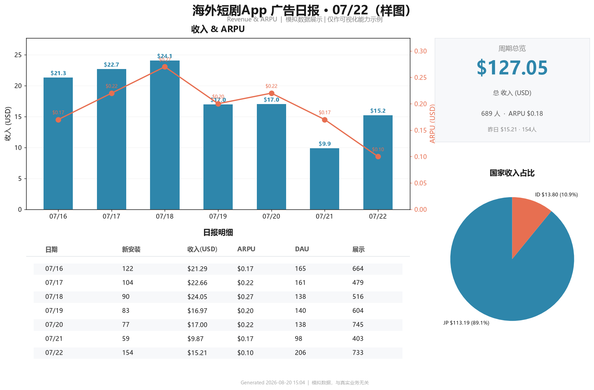

# 03. 海外短剧 App 数据分析 SQL 实战

> 实习期间针对某海外短剧 App 构建的**广告变现数据监控与归因体系**
>
> 涵盖：广告加载漏斗监控、失败归因下钻、版本/广告位/渠道透视、引导页 A/B 对比、用户语言画像

## 🎯 分析框架

```
┌──────────────────────────────────────────────────────────────────────┐
│                       广告变现数据监控闭环                              │
├──────────────────────────────────────────────────────────────────────┤
│                                                                      │
│  ① 加载漏斗         ② 失败归因         ③ 维度下钻       ④ 业务决策   │
│  ──────────         ──────────         ──────────       ──────────   │
│  ad_load      →     错误原因      →    设备型号         屏蔽清单      │
│   ↓ 展示              DNS/SSL/JS       系统版本       (建议投放跳过)  │
│  ad_show            No Fill/网络      App版本                          │
│   ↓ 点击                                运营商                          │
│  ad_click                              渠道/广告位                      │
│                                                                      │
│  ⑤ A/B 实验        ⑥ 用户画像                                           │
│  ──────────         ──────────                                           │
│  引导页开关    →     语言选择分布                                        │
│  各渠道收入         留存天数分布                                         │
│  插屏频次对比       人均广告展示                                         │
└──────────────────────────────────────────────────────────────────────┘
```

## 📂 SQL 脚本（脱敏后）

| 脚本 | 业务问题 | 核心技巧 |
| --- | --- | --- |
| [01 - 广告加载失败分析](sql/01-ad_load_failure_analysis.sql) | 加了广告但收入没涨？哪些失败原因在拖后腿？ | 15 个查询，覆盖漏斗 → 失败原因分类 → 维度下钻（设备/系统/网络/运营商/App 版本/SDK 版本）→ 用户级失败频次分布 → 广告位 × 错误原因交叉 → **建议屏蔽的设备清单** |
| [02 - 版本×广告位 透视](sql/02-ad_performance_by_placement_version.sql) | 哪个版本/广告位产出 eCPM 最高？ | 单元格内 `CONCAT(展示数/收益/eCPM)` 三合一，直接透视多版本 × 多广告位 |
| [03 - 插屏频次分布](sql/03-play_interstitial_distribution.sql) | 高频次用户是少数人刷广告还是普遍现象？ | 引导页 A/B 分组 + 频次桶（0/1-3/4-6/7-10/10+）分布 + 人均展示 |
| [04 - 用户最后语言](sql/04-user_last_language.sql) | 用户最终选了哪个语言版本？占比多少？ | ROW_NUMBER() OVER PARTITION BY 取每个用户最后一条 |
| [05 - 引导页 A/B 收入对比](sql/05-guide_screen_revenue_comparison.sql) | 引导页开关对总收入和各广告位收入的影响？ | CTE 分组 + appsflyer_id 关联收入事件 |
| [06 - 人均广告展示](sql/06-ad_avg_impressions_per_user.sql) | 每个用户平均看多少广告？各广告位贡献多少？ | 一次扫描出 10 个广告位的人均展示数 |

## 🐍 Python 自动化报表

> 原脚本涉及公司生产数据库凭证，已脱敏：DB 配置改为 `os.environ` 读取，无明文密码。

| 脚本 | 自动化任务 | 技术栈 |
| --- | --- | --- |
| [ad_funnel_report.py](python/ad_funnel_report.py) | 查库 → 算漏斗 → 出深色主题仪表盘（漏斗+堆叠+折线+明细表+自动结论） | mysql.connector + matplotlib 自定义主题 + KPI 卡片 |
| [drama_daily_report.py](python/drama_daily_report.py) | 每日广告收入/ARPU/装机日报 → 出图 → 推飞书群 | matplotlib 双轴 + 飞书 Webhook |
| [user_last_language.py](python/user_last_language.py) | 导出每个用户最后选择的语言明细到 CSV | pymysql + csv |
| [generate_sample_charts.py](python/generate_sample_charts.py) | 用**模拟数据**生成与原脚本同风格的可视化样图（不暴露真实业务数据） | matplotlib |

## 📊 可视化样图

### 广告加载漏斗（样图，模拟数据）

*4 区仪表盘：KPI 卡片 + 漏斗图 + 渠道堆叠 + 每日趋势 + 维度明细 + 自动生成结论*

### 7 日运营日报（样图，模拟数据）

*收入/ARPU 双轴 + 周期总览 KPI + 国家收入占比饼图 + 日报明细表*

> 所有样图均使用**模拟数据**生成，仅作可视化能力展示，与真实业务数据无关。

## 🔍 分析方法论亮点

**1️⃣ 漏斗 → 失败归因 → 维度下钻 → 决策清单 的完整链路**
不只是「算个转化率」，而是从加载漏斗发现 50% 流失 → 拆出 9 类失败原因（JS 引擎/DNS/SSL/No Fill/网络/SDK 内部/原生响应/频率限制/HTTP）→ 按 6 个维度交叉定位（设备/系统/网络/运营商/App 版本/SDK 版本）→ 输出「建议屏蔽的设备清单」可直接交给广告投放侧执行。

**2️⃣ 用 `event_value` JSON 字段做灵活打点**
`event_value` 是个 JSON 字符串，包含 `placement` / `error_reason` / `result` / `event_value` / `user_id` 等子字段。用 `JSON_UNQUOTE(JSON_EXTRACT(...))` 提取，能在不改表结构的情况下做任意维度分析——这要求打点协议设计时就埋好可扩展字段。

**3️⃣ 引导页 A/B 用 appsflyer_id 关联收入**
按 `o_config` 事件里 `guide_screen_1` 字段分组（true/false），再用 `appsflyer_id` 关联后续 `af_ad_view` 收入事件，量化引导页开关对总收入的因果影响（不是单看曝光数）。

**4️⃣ 自动化报表闭环**
每日跑批查库 → 生成 PNG → 通过飞书 Webhook 推到运营群。运营每天早上直接看图，不用登后台。
